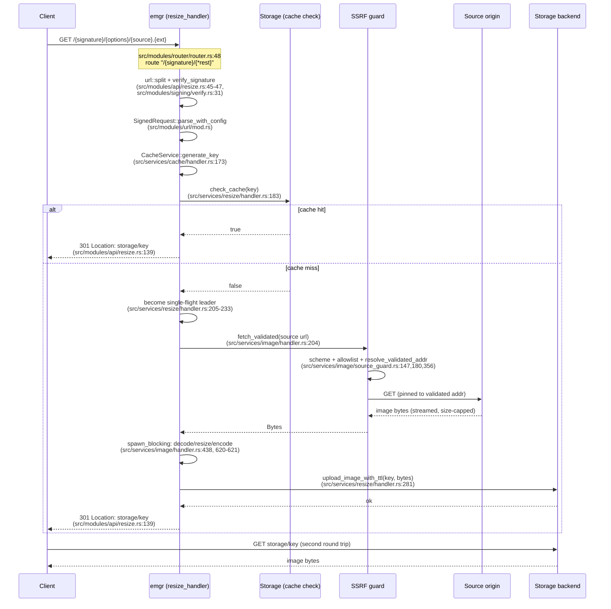

# Architecture Overview

`emgr` is an imgproxy-compatible image resizing/transcoding service written in Rust. A client
requests a resized image via a signed URL; on a cache miss `emgr` fetches the source, processes it,
writes the result to object storage, and redirects the client there. On a cache hit it skips
straight to the redirect. This redirect-based delivery model is the single most consequential
design decision in the system (see "Redirect-based delivery" below) and shapes almost everything
else documented here and in `docs/architecture/components.md`.

This file describes the system as it exists on `main` today. For component-by-component detail
(which module owns what, which files back which behaviour), see `components.md`.

## Request flow



Cache hit and cache miss both end in the same `301 Moved Permanently` redirect
(`src/modules/api/resize.rs:139`) to a URL under `StorageConfig::cdn_base_url` — never a redirect
back to the caller-supplied source (deliberately: that used to be an open redirect from a trusted
domain, and 301s are cached permanently by browsers, so a transient origin failure would have
permanently steered clients away — see the comment at `src/modules/api/resize.rs:77`). The
difference between hit and miss is entirely in what happens *before* that redirect is built.

## Redirect-based delivery: the central trade-off

`emgr` never streams processed image bytes back to the client on the same connection. Both a
cache hit and a freshly-processed cache miss end the request with a `301` pointing at the object
in storage (local filesystem, S3, or in-memory-for-tests — see "Storage backends" below); the
client then makes a second request to fetch the actual bytes. imgproxy, by contrast, streams the
processed image directly on the original connection and has no server-side result cache at all —
every request is reprocessed from scratch.

This is not an incidental implementation detail; it is the architectural choice that produces both
`emgr`'s strongest and weakest measured numbers. Across the three-way `bench-imgproxy/` runs recorded
in `.bench-baseline/BASELINE.md` (several 2-VU, medians-of-3 sweeps across the `local_fs`/`s3`
backends and both the pre- and post-AVIF `FORMATS` sweeps — the exact ratio moves with backend and
fixture mix, roughly 3.3x-3.7x cold and 2.6x-2.9x throughput across those runs), the current
headline position is:

| Path | emgr | imgproxy | Ratio |
|---|---:|---:|---:|
| Cold (cache miss), p50 | — | — | emgr **~3.48x slower** |
| Cold (cache miss), throughput | — | — | emgr **~2.86x lower** |
| Warm (cache hit), p50 | 0.39 ms | ~21 ms | not a processing comparison — see below |

- **Cold path cost.** A cache miss pays for *two* HTTP round trips per delivered image
  (`req/image = 2.00` in the baseline tables) instead of imgproxy's one: the client requests the
  resize, gets a 301, and re-fetches from storage. Part of the cold-path time is genuine
  decode/resize/encode work, but part of it is this two-hop delivery shape itself — the same shape
  that makes the warm path so cheap.
- **Warm path payoff.** A cache hit costs a single `check_cache` lookup (`src/services/resize/
  handler.rs:183`) and a redirect — no decode, no resize, no encode. `emgr` never touches the image
  pipeline for a repeat request; imgproxy has no equivalent and reprocesses every single request,
  identical bytes or not. **The warm figure above is not a processing-speed comparison and must not
  be read as one**: imgproxy has no server-side result cache at all, so "0.39 ms vs ~21 ms" measures
  an architectural difference (skip the whole pipeline vs. reprocess from scratch), not which engine
  encodes faster.
- **The trade is inherent, not a bug to fix.** The cold penalty cannot be removed without giving up
  the warm win — they are the same architecture viewed from two angles. Which one dominates in
  practice depends on production cache-hit rate, a number neither benchmark measures
  (`.bench-baseline/BASELINE.md`, "Where the remaining cold gap lives").
- In production, imgproxy is normally deployed behind an external CDN that would absorb repeat
  requests the way `emgr`'s built-in cache does natively — so the honest framing is "`emgr`'s
  built-in result cache vs. imgproxy's reliance on an external one," not "`emgr` processes images
  faster" (it measurably does not — cold: ~3.48x slower p50, ~2.86x lower throughput).

## Storage backends

Three backends implement a common `StorageBackend` trait (`src/services/storage/core.rs`), selected
by Cargo feature and, when more than one is compiled in, by the `STORAGE_TYPE` environment variable
(`src/services/storage/handler.rs:42-141`):

- **`local_fs`** (`src/services/storage/local_fs_handler.rs`) — writes to a local directory.
- **`s3`** (`src/services/storage/s3_handler.rs`) — S3-compatible object storage (MinIO-tested).
- **`in_memory`** (`src/services/storage/in_memory_handler.rs`) — an unbounded `HashMap`, gated
  `#[cfg(all(test, feature = "in_memory"))]`. It does not exist in a release build regardless of
  whether the `in_memory` Cargo feature is enabled — selecting `STORAGE_TYPE=IN_MEMORY` in
  production fails fast at startup instead of running an unbounded, uncapped cache. It exists purely
  to exercise `StorageBackend` in this crate's own tests.

The trait also carries an optional per-entry TTL (`upload_image_with_ttl`); `None` means "never
expires," the only behaviour available before TTL support existed, and still the default —
`ResizeService` has no config knob feeding a real duration into it today (`src/services/resize/
handler.rs:126-135`).

## Concurrency model

- **`tokio` async I/O** throughout, with the runtime's worker-thread count configurable
  (`TOKIO_WORKER_THREADS`, cgroup-aware default — `src/main.rs:33-51`).
- **CPU-bound work on `spawn_blocking`.** Decode/resize/encode runs on tokio's managed blocking
  thread pool, not a hand-rolled `rayon` pool — `rayon`'s value proposition is intra-job work-
  stealing parallelism, and nothing in this pipeline fans a single image's work out across threads
  (`src/services/image/handler.rs:358-373`). `rayon` is not a dependency of this crate.
- **Two independent semaphores** bound in-flight work: `download_semaphore` caps concurrent source
  fetches, `processing_semaphore` caps concurrent CPU-bound decode/resize/encode jobs
  (`src/services/image/handler.rs:117-127`). Both shed load with an error rather than queue when
  exhausted.
- **Single-flight coalescing.** Once a cache miss is confirmed, concurrent requests for the same
  cache key share one leader's work instead of each downloading/processing/uploading independently
  (`src/services/resize/handler.rs:29-127`, issue #37). An `RAII` guard broadcasts the leader's
  result (or a synthetic failure, if the leader panics or is cancelled) to every follower via a
  `tokio::sync::broadcast` channel, so followers can never hang indefinitely.
- **Router-level saturation shedding and rate limiting** (`src/modules/router/middlewares.rs`):
  a `tokio::sync::Semaphore`-based concurrency cap plus request timeout
  (`saturation_and_timeout_middleware`, `503` on exhaustion), and per-IP token-bucket rate limiting
  via `tower_governor` (`429 Too Many Requests` on excess).

## Security boundary

- **HMAC-SHA256 signed URLs** (`src/modules/signing/`), imgproxy-compatible
  (`HMAC-SHA256(key, salt || signed_path)`, constant-time comparison). Signing configuration fails
  closed at process startup (`SigningConfig::from_env`) rather than silently accepting unsigned
  traffic if misconfigured — an explicit `ALLOW_UNSIGNED_REQUESTS=true` opt-in is required to use
  the `/unsigned/...` escape hatch for local development.
- **SSRF guard** (`src/services/image/source_guard.rs`) applied to every source fetch (and every
  watermark fetch, which reuses the same guarded path):
  - Scheme allowlist: only `http`/`https` (`validate_scheme`).
  - Optional `ALLOWED_SOURCES` prefix allowlist, matched structurally (parsed scheme/host/port/path
    segments, never raw-text `starts_with`) to close userinfo-spoofing and subdomain-boundary
    bypasses (`is_allowed_source`, `matches_allowed_prefix`).
  - Private/loopback/link-local/CGNAT/IPv6-ULA range blocking, including decimal/octal/hex IPv4
    literal decoding (`is_blocked_ip_with_policy`, `parse_ip_literal`), independently toggleable via
    `ALLOW_LOOPBACK_SOURCE_ADDRESSES`/`ALLOW_LINK_LOCAL_SOURCE_ADDRESSES`.
  - **DNS-rebinding pinning:** the address is resolved and validated once, then the HTTP client is
    pinned to that exact `SocketAddr` for the connection (`build_pinned_client`) — a second,
    attacker-controlled DNS answer at connect time can never be observed.
  - **Per-hop redirect revalidation:** redirects are followed manually (`reqwest`'s own redirect
    handling is disabled), and every check above re-runs for each hop's new location
    (`fetch_validated`, `src/services/image/handler.rs:204-278`) — an `ALLOWED_SOURCES` match is
    recomputed per hop, so a bypass on one allowlisted host never carries over to a redirect target
    that doesn't independently match.
- **Streaming download size cap.** `Content-Length` is checked as a cheap early rejection, but the
  real enforcement streams the body and aborts once the running total exceeds the cap — closing the
  gap a dishonest origin or chunked transfer encoding (no `Content-Length`) would otherwise leave
  open (`download_image`, `src/services/image/handler.rs:291-347`).
- **Decompression-bomb guard.** Image dimensions are read from the header only
  (`peek_dimensions`/`ImageReader::into_dimensions`) and checked against `MAX_SRC_RESOLUTION_MP`
  *before* any full decode is attempted, so a small-on-disk/huge-decoded source is rejected without
  ever allocating the decoded buffer (`process_image_blocking_with_limits`'s call site,
  `src/services/image/handler.rs:617-618`; `check_source_resolution`, `:3007-3024`).
- **Strict storage-key grammar** (`src/services/storage/key_validation.rs`) rejects any key that
  doesn't match exactly what `CacheService::generate_key` can produce, closing IDOR/traversal
  against both the download route and every storage backend.
- **`/metrics` bearer-token auth** (`src/modules/metrics_auth/`), gated behind the `otel` feature,
  fails closed at startup the same way signing does. `/health` is deliberately left unauthenticated
  — it is the target of Kubernetes liveness/readiness/startup probes, which have no practical way to
  carry a bearer token, and it only ever returns the literal string `"OK"`.

## Codec choices

- **JPEG decode and encode** go through `mozjpeg` (libjpeg-turbo bindings), not the `image` crate's
  pure-Rust path — DCT-scaled decode when a resize makes a smaller decode safe, full-size decode
  otherwise, with a fallback to the `image`-crate decoder on any mozjpeg failure. See `adr/0001-
  image-engine.md` for the original engine decision and `.bench-baseline/BASELINE.md`'s "Post-#67
  baseline" for the measured decode-side numbers.
- **Resampling** uses the `fast_image_resize` crate rather than `image`'s own `DynamicImage::resize`
  kernel — several times faster at equivalent measured quality (DSSIM); see `.bench-baseline/
  BASELINE.md`'s "Current baseline" section.
- **WebP encode** goes through the `webp` crate (real lossy libwebp), not the `image` crate's
  lossless-only WebP encoder. See `adr/0001-image-engine.md` (original rationale) and `adr/0003-
  webp-measurement.md` (corrected byte-size measurement on real photos).
- **WebP decode** (#66) goes through a dedicated real-libwebp FFI path
  (`ImageService::decode_webp_libwebp`/`libwebp_decode`, `src/services/image/handler.rs:3294`),
  replacing the `image` crate's pure-Rust `image-webp` decoder — ~29% *slower* on the synthetic
  fixture but ~2.24x *faster* on 24 real Kodak photographs (scratch-crate measurement, pixel-identical
  DSSIM 0.0, `adr/0003-webp-measurement.md`), with a fallback to the `image`-crate decoder on any
  libwebp failure. The synthetic-vs-real inversion is why the criterion suite now benches both
  fixture kinds — see [Testing](../development/testing.md#two-fixture-kinds-synthetic-and-photo).
- **AVIF encode and decode** both go through `libavif` (`src/services/image/avif_codec.rs`) — AOM
  for encode (replacing the pure-Rust `ravif`/`rav1e` encoder `adr/0004-avif-measurement.md`
  measured) and dav1d for decode (previously unsupported). See that module's own doc comment for
  the dependency/codec choice, and the AVIF work's own change report for the re-measured byte-size/
  encode-time numbers against the `adr/0004` baseline.

## Cache key design

`CacheService::generate_key` (`src/services/cache/handler.rs`) hashes a version byte followed by
every resize-affecting parameter, each **length-prefixed** rather than delimiter-separated:
`hasher.update(len_be_bytes); hasher.update(field_bytes)` per field. This matters because `url` is
fully attacker-controlled — a fixed delimiter byte (e.g. `|` or `\0`) could appear inside the URL
itself and be used to forge a byte stream that collides with a different, legitimate parameter
combination. A 4-byte big-endian length prefix makes every field boundary unambiguous regardless of
the field's own content, so the mapping from `(field_1, .., field_n)` to the hashed stream is
injective. The leading version byte (currently `11`, `CACHE_KEY_VERSION`, `src/services/cache/
handler.rs:147`) is bumped whenever the hashed layout or the encoder/decoder producing the cached
bytes changes in a way that would otherwise let old and new entries collide or serve stale output —
see the version history documented directly in that file's `CACHE_KEY_VERSION` doc comment,
including a case where a bump was deliberately *not* taken (issue #67's WebP decoder swap to
libwebp) because the output was measured perceptually identical (DSSIM 0.0 across 24 real photos)
and a bump would have forced a full reprocessing storm for zero visible benefit. The two most recent
bumps: v10 for #5's metadata-strip-by-default cutover, v11 for the AVIF encoder moving from
`ravif`/`rav1e` to `libavif`/AOM.

## Request lifecycle, including rejections

```mermaid
stateDiagram-v2
    [*] --> PathReceived: GET /{signature}/{*rest}<br/>src/modules/router/router.rs:48

    PathReceived --> RateLimited: over per-IP burst<br/>tower_governor, src/modules/router/middlewares.rs:292
    RateLimited --> [*]: 429 Too Many Requests

    PathReceived --> Saturated: concurrency cap exceeded<br/>src/modules/router/middlewares.rs:119-135
    Saturated --> [*]: 503 service at capacity

    PathReceived --> SplitPath: url::split<br/>src/modules/url/mod.rs:76
    SplitPath --> BadGrammar: malformed path
    BadGrammar --> [*]: 400 Bad Request<br/>src/modules/api/resize.rs:129 (url_parse_error)

    SplitPath --> VerifySignature: verify_or_reject<br/>src/modules/api/resize.rs:90
    VerifySignature --> BadSignature: missing/wrong signature,<br/>or unsigned not allowed
    BadSignature --> [*]: 403 Forbidden<br/>src/modules/api/resize.rs:95,105,118

    VerifySignature --> ParseOptions: SignedRequest::parse_with_config<br/>src/modules/url/mod.rs
    ParseOptions --> BadOptions: unknown/disallowed option,<br/>bad value, unknown preset
    BadOptions --> [*]: 400 Bad Request

    ParseOptions --> CacheKeyed: CacheService::generate_key
    CacheKeyed --> CacheHit: check_cache = true<br/>src/services/resize/handler.rs:183
    CacheHit --> [*]: 301 redirect to storage

    CacheKeyed --> SingleFlight: check_cache = false
    SingleFlight --> Fetching: this caller is leader<br/>src/services/resize/handler.rs:205-233

    Fetching --> SsrfBlocked: scheme/allowlist/IP-range<br/>rejected, src/services/image/source_guard.rs
    SsrfBlocked --> [*]: 400 Bad Request<br/>(SourceRejected downcast,<br/>src/modules/utils/err.rs:109-115)

    Fetching --> OversizedSource: streamed size exceeds<br/>MAX_IMAGE_SIZE_MB, src/services/image/handler.rs:291-347
    OversizedSource --> [*]: 400 Bad Request<br/>("too large", src/modules/utils/err.rs:120-124)

    Fetching --> Decoding: source fetched
    Decoding --> OverResolutionSource: header-only dimension check<br/>fails MAX_SRC_RESOLUTION_MP,<br/>src/services/image/handler.rs:617-618,3007-3024
    OverResolutionSource --> [*]: 400 Bad Request<br/>("too large", src/modules/utils/err.rs:120-124)

    Decoding --> Processing: spawn_blocking decode/resize/encode<br/>src/services/image/handler.rs:438,620-621
    Processing --> Uploading: upload_image_with_ttl<br/>src/services/resize/handler.rs:281
    Uploading --> Delivered: 301 redirect to storage
    Delivered --> [*]

    SingleFlight --> Following: another caller is leader
    Following --> Delivered: leader's broadcast result
    Following --> LeaderFailed: leader panicked/cancelled
    LeaderFailed --> [*]: error propagated from leader's failure
```

Every rejection state above maps to a non-cacheable response (`Cache-Control: no-store`,
`src/modules/utils/err.rs`) — a cached error is worse than an uncached one, since a CDN or client
would otherwise treat a transient failure as permanent.

## Technology stack

- **Language:** Rust (2024 edition).
- **Web framework:** `axum`, with `tower_governor` for rate limiting and `tower-http` for
  compression/CORS.
- **Image processing:** `image` (container formats, PNG/GIF/AVIF paths), `mozjpeg` (JPEG decode +
  encode), `fast_image_resize` (resampling), `webp` crate (lossy WebP).
- **Storage:** `aws-sdk-s3` (S3/MinIO), local filesystem, in-memory (test-only).
- **Observability:** OpenTelemetry tracing/metrics behind the `otel` Cargo feature
  (`src/modules/tracer/`), Prometheus-format `/metrics` behind bearer-token auth.
- **Allocator:** `mimalloc` as the global allocator (`src/main.rs`).

There is no generated OpenAPI server in this codebase today. The service used to be built around a
`gen-server`/`packages/`/`openapi.yaml` generated router; that was removed as part of a hand-written-
router rewrite (issue #53) and no longer exists anywhere in the tree or in `Cargo.toml`.
