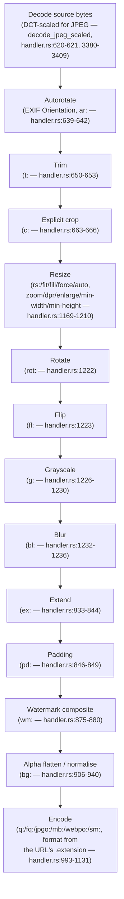

# API Reference

`emgr` exposes a small HTTP API for resizing and then downloading images.
This page is the source of truth for it. There is no OpenAPI spec and no
generated client any more — [GH #53](https://github.com/vaam-store/image-resizer/issues/53)
deleted `openapi.yaml` and the codegen pipeline that consumed it, replacing
the old query-parameter `GET /api/images/resize?...` endpoint with an
imgproxy-compatible signed URL path (implemented under
[#27](https://github.com/vaam-store/image-resizer/issues/27) alongside HMAC
signing — see the [rationale in ADR 0002](https://github.com/vaam-store/image-resizer/blob/main/adr/0002-url-api-shape.md)).
This was a hard cutover: the old query-parameter route is gone, not
aliased, and there is nothing left to regenerate a client from.

## Base URL

There is no versioned path prefix (no `/api/v1`) — every route below is
relative to the service root, e.g. `http://localhost:3000`.

## The most important divergence from imgproxy: `g:` is grayscale, not gravity

In imgproxy, `g:` is the **gravity** option. In `emgr`, `g:` is
**grayscale** — gravity is `gr:` instead.

This isn't a typo or an oversight; it's a deliberate, recorded decision
([ADR 0002, "Amendment 2026-08-20: the `g:` option collision"](https://github.com/vaam-store/image-resizer/blob/main/adr/0002-url-api-shape.md#amendment-2026-08-20-the-g-option-collision-73)).
`g:` was already grayscale in this service before anyone noticed imgproxy
uses the same prefix for gravity, and the repository owner chose to keep
`g:` as grayscale rather than break it.

**Practical consequence, verified against `parse_bool`/the `g` match arm
(`options.rs:383-386`, `731-740`):** `g:` here accepts exactly one
argument, and it must parse as a boolean (`true`/`false`/`1`/`0`). Every
real imgproxy gravity token (`ce`, `no`, `so`, `ea`, `we`, `noea`, `nowe`,
`soea`, `sowe`, `sm`, `obj`, `objw`, or a 3-argument `fp:{x}:{y}`) fails
that boolean parse — so an imgproxy URL that tries to use `g:` for gravity
does not get silently misread into a different, wrong result; it gets
rejected with `400 Bad Request`. That's a real, verified improvement on
the "silently misread" outcome the collision could in principle produce —
but it's still a hard migration break, not a compatible fallback: any
client library that assumes imgproxy's `g:` means gravity gets a `400`
instead of the anchored crop it expected, and has to be changed to send
`gr:` for gravity while reserving `g:` for grayscale. If you are migrating
from imgproxy and use gravity at all, rewrite `g:` to `gr:` first.

Every other short option code below matches imgproxy's own vocabulary.

## Endpoints

### Resize an image (signed URL)

```
GET /{signature}/{processing_options}/{plain|base64 source}.{extension}
```

Fetches the source image, resizes/transforms it, stores the result, and
redirects to it (`301`) — it does not stream the resized bytes back
directly (see [Download a resized image](#download-a-resized-image)
below).

#### `{signature}`

Either:

- A URL-safe base64 (no padding) HMAC-SHA256 signature over
  `salt || {processing_options}/{source}.{extension}` — the request path
  *after* the signature segment, leading `/` included, exactly as received
  on the wire, still percent-encoded — keyed by `SIGNING_KEY`/`SIGNING_SALT`
  ([Configuration](../getting-started/configuration.md#signed-urls)).
  Computed as `base64url_nopad(HMAC-SHA256(key, salt || signed_path))`
  (`src/modules/signing/verify.rs:9-20`) and verified in constant time
  (`verify_signature`, `src/modules/signing/verify.rs:31-43`).
- The literal string `unsigned` — only accepted when the operator has set
  `ALLOW_UNSIGNED_REQUESTS=true`. Refused with `403` otherwise
  (`src/modules/api/resize.rs:90-108`).

An invalid, missing, or (when not explicitly allowed) `unsigned` signature
returns `403 Forbidden` *before* the processing-options grammar is parsed
at all — an unauthenticated caller never gets parse-error feedback as an
oracle (`src/modules/api/resize.rs:85-89`).

**This service fails closed at startup, not per-request.** If
`SIGNING_KEY`/`SIGNING_SALT` are unset (or invalid hex) *and*
`ALLOW_UNSIGNED_REQUESTS` is not explicitly `true`, the process refuses to
start at all, rather than coming up and serving `403` to every caller
(`SigningConfig::from_env`, `src/modules/signing/config.rs:42-68`). Signing
is the default; `unsigned` is a local-development escape hatch, never a
fallback an operator accidentally ends up running in production.

#### `{processing_options}`

Zero or more `/`-delimited segments, each `code:arg1:arg2:...`. An unknown
option code, wrong argument count, or an out-of-range value returns
`400 Bad Request` (`UrlParseError::UnknownOption` /
`InvalidOptionValue`, `src/modules/url/mod.rs:39-42`).

##### Simple options

Every option below is parsed in `src/modules/url/options.rs`; the line
range for each `match` arm is cited so this table can be re-verified
against the code later.

| Code | Syntax | Default | What it does | imgproxy equivalent |
|---|---|---|---|---|
| `rs` | `rs:{type}:{width}:{height}` | no resize | Resize per `{type}` once both dimensions are non-zero; a lone width or height resizes preserving aspect ratio. `{type}` is one of `fit`/`fill`/`force`/`auto` — see [Resize type (`rs:`)](#resize-type-rs) below. `0` for either dimension means "not set". (`options.rs:229-245`) | Same option, same name. |
| `q` | `q:{0-100}` | encoder default (JPEG 75 / WebP 82 / AVIF 80) | Global output encode quality. Overridden per-format by `fq:`. (`options.rs:246-249`; `DEFAULT_JPEG_QUALITY`/`DEFAULT_WEBP_QUALITY`/`DEFAULT_AVIF_QUALITY`, `src/services/image/handler.rs:51,41,67`) | Same. |
| `fq` | `fq:{format1}:{q1}:{format2}:{q2}:...` | — | Per-format quality override, redefining `q:` for one or more formats in the same request. Only `jpg`/`jpeg` and `webp` are accepted — `fq:png:N` is a `400`, because PNG output here has no continuous quality knob (fixed `CompressionType::Best`). Repeating a format lets the later pair win. (`options.rs:250-293`) | Same option (`format_quality`); imgproxy also silently ignores `png`/other unsupported formats — this service rejects them instead. |
| `webpo` | `webpo:{compression}` | lossy | WebP compression mode: `lossy` or `lossless` only. **Only the first of imgproxy's three `webp_options` slots is implemented** — `smart_subsample` and `preset` are rejected (`400`) if supplied, not silently ignored, because the underlying `webp` crate has no equivalent knob and no `mixed` mode either. (`options.rs:294-324`) | Partial: imgproxy's `webp_options`/`webpo:{compression}:{smart_subsample}:{preset}`. |
| `jpgo` | `jpgo:{progressive}:{no_subsample}` | deployment default | JPEG encode tuning. **Only the first two of imgproxy's six slots are implemented** — `trellis_quant`, `overshoot_deringing`, `optimize_scans`, `quant_table` are rejected (`400`) rather than silently ignored, since `mozjpeg::Compress` has no direct equivalent for them. Each of the two implemented slots may be left blank (`jpgo:1:`) to keep this deployment's configured default (`JPEG_PROGRESSIVE`/`JPEG_NO_SUBSAMPLING`). See [subsection](#jpeg-tuning-jpgo) below. (`options.rs:325-361`) | Partial: imgproxy's `jpeg_options`/`jpgo:{progressive}:{no_subsample}:{trellis_quant}:{overshoot_deringing}:{optimize_scans}:{quant_table}`. |
| `mb` | `mb:{bytes}` | none (no limit) | Maximum encoded output size in bytes; the encoder iteratively lowers quality until the output fits (or a bounded search is exhausted). `0` means "not set". **Only applied to JPEG output** — WebP, PNG, AVIF and GIF ignore it entirely (`encode_single_image`, `src/services/image/handler.rs:1051-1083`). | Diverges: imgproxy's `max_bytes` also applies to WebP; this service's does not. |
| `bl` | `bl:{sigma}` | none | Gaussian blur sigma, applied after resize/rotate/flip. (`options.rs:379-382`) | Same. |
| `g` | `g:{true\|false\|1\|0}` | none (off) | **Grayscale** — see the [callout above](#the-most-important-divergence-from-imgproxy-g-is-grayscale-not-gravity). (`options.rs:383-386`) | **Diverges — imgproxy's `g:` is gravity.** |
| `el` | `el:{true\|false\|1\|0}` | `false` | Enlarge: permit upscaling past the source resolution. Refused by default ([GH #36](https://github.com/vaam-store/image-resizer/issues/36)). | Same. |
| `bg` | `bg:{R}:{G}:{B}` or `bg:{hex}` | opaque white | Background colour used to flatten alpha for formats with no alpha channel (JPEG) and to normalise fully-transparent pixels for formats that keep alpha (PNG/WebP/AVIF/GIF). `{hex}` accepts 3- or 6-digit hex, no leading `#`. (`options.rs:391-396`, `params.rs:348-359`) | Same, except imgproxy's default is "disabled" (no flatten); this service always flattens. |
| `ar` | `ar:{true\|false\|1\|0}` | `true` (on) | Auto-rotate per the source's EXIF `Orientation` tag, before any resize/crop. Note the default is `true` here — unlike every other boolean option on this list. (`options.rs:404-407`, `params.rs:361-379`) | Same, including the `true` default. |
| `sm` | `sm:{true\|false\|1\|0}` | `true` (strip) | Strip the source's EXIF metadata (GPS, camera make/model, timestamps, ...) from the output instead of forwarding it. Like `ar`, the default is `true` — unlike every other boolean option on this list except `ar`, and a deliberate behaviour change from before this option existed (EXIF used to be silently dropped for every format anyway, just as an accident of no encoder being asked to write it, not a considered default). Governs EXIF only: the embedded ICC colour profile is a separate, always-forwarded concern (see [Processing pipeline order](#processing-pipeline-order)), and a kept EXIF blob has its `Orientation` tag neutralised to `1` when `ar` already rotated the pixels, so a viewer can't double-rotate. Real per-format support for *writing* kept EXIF back out: JPEG (raw `mozjpeg` `APP1` marker) and PNG/AVIF (`ImageEncoder::set_exif_metadata`) honour `sm:0`; WebP and GIF cannot — their encoders have no EXIF API at all, so `sm:0` against those output formats is a documented no-op. (`options.rs:408-420`, `params.rs:381-430`, `encode_single_image`, `src/services/image/handler.rs:700-753`) | Same option, same name and default (`IMGPROXY_STRIP_METADATA: true`). imgproxy additionally exposes `strip_color_profile`/`scp` (strip + convert ICC to sRGB — not implemented here; would need a colour-management dependency this crate doesn't have) and `keep_copyright`/`kcr` (retain just the copyright field while otherwise stripping — not implemented here; would need an EXIF/IPTC/XMP field-level parser this crate doesn't have). `sm` here is all-or-nothing. |
| `rot` | `rot:{angle}` | `0` | Rotate clockwise by `{angle}` degrees, applied *after* resize. Must be a multiple of 90 (negative allowed, normalised via `rem_euclid(360)`). (`options.rs:470-473`) | Same. |
| `fl` | `fl:{horizontal}:{vertical}` | `0:0` | Flip. Each slot is an independent boolean; `fl:1` flips only horizontally. Applied immediately after `rot:`. (`options.rs:474-491`) | Same. |
| `ex` | `ex:{true\|false\|1\|0}` | `false` | Extend: pad the resized image up to the full requested `width`x`height` (centred, background-filled) if the resize would otherwise come out smaller. No-op unless both `width` and `height` are set. **Only the boolean argument is accepted** — imgproxy's optional trailing `:gravity` argument is rejected (`400`), since only centre-gravity extend is implemented. (`options.rs:501-509`) | Partial: imgproxy's `extend`/`ex:{enabled}:{gravity}` — the gravity slot isn't supported here. |
| `z` | `z:{zoom}` or `z:{zoom_x}:{zoom_y}` | `1.0:1.0` | Multiplies an axis's requested size before resize. A single argument sets both axes. **Only scales an axis that already has an explicit `width`/`height` set** — unlike imgproxy, this service cannot zoom the "natural" source size with no explicit dimension. (`options.rs:516-522`, `effective_resize_box`, `src/services/image/handler.rs:2787-2795`) | Diverges: imgproxy can also scale with no explicit width/height; this service can't. |
| `dpr` | `dpr:{value}` | `1.0` | Device-pixel-ratio multiplier, same mechanics and same "only scales an axis with an explicit dimension" narrowing as `z:` above — combined multiplicatively with it on the same axis. (`options.rs:523-527`) | Diverges the same way `z:` does. |
| `mw` | `mw:{width}` | none | Minimum *resulting* width — a floor, not a cap. **Not gated by `el:`**: it can force upscaling past the source even with `el:0`, matching imgproxy's own behaviour. (`options.rs:528-534`) | Same (`min-width`). |
| `mh` | `mh:{height}` | none | Same as `mw`, for height. (`options.rs:535-538`) | Same (`min-height`). |

##### Resize type (`rs:`)

```
rs:{type}:{width}:{height}
```

`{type}` is one of:

| Type | Behaviour |
|---|---|
| `fit` (default) | Scale to fit *inside* the box, preserving aspect ratio — neither output dimension exceeds the requested one. |
| `fill` | Scale to *cover* the box preserving aspect ratio, then crop the overflow, anchored by [`gr:`](#gravity-gr) (default centre). |
| `force` | Stretch to exactly `width`x`height`, ignoring aspect ratio. |
| `auto` | `fill` when the source and requested boxes share orientation (both landscape-or-square, or both portrait); `fit` otherwise. |

An empty type slot (`rs::800:600`) also defaults to `fit`. An unrecognised
type is rejected with `400`, not silently substituted
(`ResizeType::from_str`, `src/models/params.rs:113-133`; dispatch in
`src/services/image/handler.rs:1169-1210`).

##### Explicit crop (`c:`)

```
c:{width}:{height}[:{gravity_tokens...}]
```

Crops the *decoded, autorotated, trimmed* image to `{width}`x`{height}`
before any resize math runs (`process_image_blocking_with_limits`,
`src/services/image/handler.rs:620-666`). Each dimension follows a
three-way convention (`options.rs:810-834`, `parse_crop_dimension`):

- `0` — use the full source dimension on that axis (no crop on that axis).
- `>= 1` — absolute pixel size.
- `(0, 1)` — a fraction of the source dimension on that axis.

An optional trailing gravity anchors the crop within the source image,
using the same token vocabulary as [`gr:`](#gravity-gr) below (`ce`, `no`,
`so`, `ea`, `we`, `noea`, `nowe`, `soea`, `sowe`, or `fp:{x}:{y}`). If
omitted, the crop inherits whatever `gr:` sets elsewhere in the URL —
order-independent, since resolution happens after the whole URL has been
parsed (`options.rs:75-80`, `591-596`).

##### Gravity (`gr:`)

```
gr:{type}
gr:fp:{x}:{y}
```

Anchors two things: the overflow-crop side of `rs:fill`/`rs:auto`, and an
explicit `c:` crop that doesn't name its own gravity. `{type}` is one of
`ce` (centre, default), `no`, `so`, `ea`, `we`, `noea`, `nowe`, `soea`,
`sowe`, or `fp:{x}:{y}` — a focus point, `x`/`y` fractions in `[0, 1]` of
the image (`options.rs:848-884`).

Two divergences from imgproxy, both deliberate:

- **This is `gr:`, not `g:`** — see the [callout above](#the-most-important-divergence-from-imgproxy-g-is-grayscale-not-gravity).
- **Smart/saliency gravity (`sm`) and object-detection gravity (`obj`,
  `objw`, imgproxy Pro) are rejected with `400`**, not silently aliased to
  `ce` or any other gravity — there is no saliency/object-detection
  implementation behind them (`options.rs:842-847`, `879-883`;
  `Gravity`'s doc comment, `src/models/params.rs:149-155`).
- **No `x_offset`/`y_offset` nudge** on the directional/corner/centre
  variants. imgproxy lets every gravity type take an extra offset pair;
  this service only exposes an offset-like mechanism for `fp:{x}:{y}`
  (where the fraction *is* the point) — `gr:no:10:20` is rejected, it is
  not "north, nudged by 10x20" (`Gravity`'s doc comment,
  `src/models/params.rs:141-148`).

##### Watermark (`wm:` and friends)

```
wm:{opacity}[:{position}[:{x_offset}[:{y_offset}[:{scale}]]]]
wmu:{base64url-encoded-watermark-url}
wms:{width}:{height}
wmr:{angle}
wmsh:{sigma}
```

**Only image watermarking is implemented — imgproxy's text watermarking
has no equivalent here at all** (no `wmt:`/text-drawing option exists in
the grammar).

`wm:` is what actually enables watermarking; every other field below is a
modifier that has no effect unless `wm:` is also present
(`options.rs:132-138`). Composited after resize/rotate/flip/grayscale/blur
but before the alpha-flatten/normalise stage, so the watermark's own alpha
is correctly composited rather than slipping past it
(`src/services/image/handler.rs:875-880`).

| Field | Syntax | Default | Meaning |
|---|---|---|---|
| Opacity (required) | `wm:{opacity}` | — | Final opacity, clamped to `[0, 1]`. |
| Position | `wm:{opacity}:{position}` | `ce` | One of `ce`, `no`, `so`, `ea`, `we`, `noea`, `nowe`, `soea`, `sowe`. **Tiling modes `re` (repeat) and `ch` (chessboard) are documented by imgproxy but not implemented** — rejected with `400` like any other unsupported value (`options.rs:669-693`). |
| X offset | `wm:{opacity}:{position}:{x_offset}` | `0` | From `position`'s anchor. `>= 1.0` magnitude is absolute pixels; smaller is a fraction of the base image's width. |
| Y offset | `wm:{opacity}:{position}:{x}:{y_offset}` | `0` | Same convention, against height. |
| Scale | `wm:{opacity}:{position}:{x}:{y}:{scale}` | `0` (no scaling) | Watermark size as a fraction of the base image, fit preserving the watermark's own aspect ratio. |
| Source URL | `wmu:{base64url}` | this deployment's `WATERMARK_URL` | Per-request watermark image, decoded here; SSRF-validated at fetch time through the same guard as the main source URL. |
| Size | `wms:{width}:{height}` | natural size | Explicit watermark dimensions; either may be `0` to derive from the other via the watermark's own aspect ratio. Always fit, never stretched. |
| Rotate | `wmr:{angle}` | `0` | Clockwise degrees. |
| Shadow | `wmsh:{sigma}` | none | Gaussian-blur sigma for a drop-shadow silhouette behind the watermark. |

Every trailing slot in `wm:` may be omitted (a shorter segment) or left
blank (`wm:0.5::10`) to keep its default (`options.rs:632-667`).

##### JPEG tuning (`jpgo:`)

```
jpgo:{progressive}:{no_subsample}
```

- `progressive` (`true`/`false`/`1`/`0`) — encode JPEG progressively
  instead of baseline sequential.
- `no_subsample` — encode chroma at full resolution (4:4:4) instead of
  this service's default 4:2:2.

Either slot left blank keeps this deployment's configured default
(`JPEG_PROGRESSIVE`/`JPEG_NO_SUBSAMPLING`, resolved in
`encode_single_image`, `src/services/image/handler.rs:1056-1061`). imgproxy's
remaining four slots (`trellis_quant`, `overshoot_deringing`,
`optimize_scans`, `quant_table`) are **not implemented and are rejected
with `400`** if a third argument or beyond is present — there is no
equivalent knob in the `mozjpeg` encoder this service routes JPEG through.

##### Trim (`t:`)

```
t:{threshold}:{color}:{equal_hor}:{equal_ver}
```

Removes uniform-colour borders. Always the *first* geometry operation
applied, right after decode/autorotate and before crop/resize
(`src/services/image/handler.rs:644-653`).

- `threshold` (required) — colour-similarity tolerance, compared as the
  maximum per-channel (Chebyshev) distance from the target colour. This is
  a simpler, more predictable metric than imgproxy's own perceptual
  "smart" trim.
- `color` (optional hex, no leading `#`) — the colour to treat as
  background. Defaults to auto-detecting from the image's own top-left
  corner pixel — a deliberately simpler stand-in for imgproxy's
  multi-corner smart detection.
- `equal_hor` / `equal_ver` (optional booleans, default `false`) — when
  set, the two opposing trim amounts on that axis are clamped to their
  minimum, so only a symmetric amount is cut.

##### Padding (`pd:`)

```
pd:{top}:{right}:{bottom}:{left}
```

CSS-shorthand-style cascading fallback, reproducing imgproxy's exact
positional-with-fallback parse (`options.rs:947-993`):

- `right` falls back to `top` when omitted/empty.
- `bottom` falls back to `top` (not `right`) when omitted/empty.
- `left` falls back to `right`'s already-resolved value when omitted/empty.

So `pd:10` pads every side by 10, `pd:10:20` pads top/bottom 10 and
left/right 20, `pd:10:20:30` pads top 10, left/right 20, bottom 30 — same
as CSS's 1/2/3/4-value shorthand, even though the underlying parse is
positional, not a value-count switch. At least the `top` argument must be
present. Applied after `ex:` (extend), always enlarging the canvas via a
`background`-coloured fill.

##### Presets (`pr:`) and the processing-option allowlist

```
pr:{name}[:{name2}...]
```

`pr:` is parsed in `src/modules/url/mod.rs` (`parse_with_config`,
`mod.rs:119-159`), not in `options.rs` like every option above — it's
expanded into the option segments it names *before* `ProcessingOptions`
ever sees them, so it isn't a "code" in the same sense as `rs`/`q`/etc.

- `PRESETS` (env var; imgproxy: `IMGPROXY_PRESETS`) configures named,
  reusable option-segment lists: `thumbnail=rs:fill:300:300/q:80,default=el:1`.
  See `src/modules/url/presets.rs`.
- A preset named `default` is applied automatically ahead of every
  request's own segments, even when the request never names a preset —
  overridable by a later explicit option in the same request, since
  segments apply in order.
- A `pr:{name}` segment referencing an unknown preset returns `400`
  (`UnknownPreset`).
- Presets cannot reference other presets — rejected at config-load time.
- `ALLOWED_PROCESSING_OPTIONS` (env var; imgproxy:
  `IMGPROXY_ALLOWED_PROCESSING_OPTIONS`) is a comma-separated allowlist of
  option codes permitted **directly** in a request URL. It does **not**
  apply to options used *inside* a preset's own definition — this is what
  lets an operator hand out a restricted set of presets while forbidding
  the raw options they're built from. An option excluded by the allowlist
  returns `400` (`OptionNotAllowed`).

See [Configuration](../getting-started/configuration.md) for how to set
both env vars.

#### Processing pipeline order

Several options interact, and the order they're applied in is not obvious
from the URL alone — for example, `t:` (trim) always runs before `c:`
(crop), and `rot:`/`fl:` run *after* resize, not before. `sm:` (metadata
strip/keep) is not a geometry step at all — it's resolved once at the very
top of the encode stage (node N below) and only affects what the chosen
encoder writes, not any pixel transform. This is the exact order
`ImageService` applies them in
(`src/services/image/handler.rs:521-1134`):



Two ordering consequences worth calling out explicitly:

- Because trim runs before crop and crop runs before resize, `c:`'s
  `width`/`height` are measured against the *trimmed* image, not the
  original source.
- Because `rot:`/`fl:` run *after* resize (matching imgproxy's own
  pipeline), a 90°/270° rotation's effect on *which axis* gets which
  requested dimension is already accounted for earlier, in the resize-box
  calculation itself (`effective_resize_box`,
  `src/services/image/handler.rs:2685-2829`) — the rotation you see here
  is purely the final pixel rotation.

#### `{plain|base64 source}.{extension}`

The trailing `.{extension}` is mandatory and always determines the output
format — it is stripped from whatever precedes it, regardless of what that
looks like. Recognised extensions
(`KNOWN_EXTENSIONS`, `src/modules/url/source.rs:20`):

| Extension | Output format | Notes |
|---|---|---|
| `jpg` / `jpeg` | JPEG | Encoded via `mozjpeg`/libjpeg-turbo (not `image`'s built-in encoder) so `jpgo:`/`mb:` actually reach the encoder. |
| `png` | PNG | Fixed `CompressionType::Best`; no continuous quality knob (`fq:png:N` is rejected at parse time). |
| `webp` | WebP | Decoded via `libwebp` (real libwebp via FFI, not `image-webp`'s pure-Rust decoder); encoded via the `webp` crate. `webpo:lossless` for lossless. |
| `avif` | AVIF | **Encode and decode.** Both directions via `libavif` (`src/services/image/avif_codec.rs`): AOM for encode, dav1d for decode. See the AVIF note below. |
| `gif` | GIF | Supports decode and encode, including multi-frame animation when the source is itself animated and the request is `.gif` or `.webp`. |
| `auto` | Negotiated | Not a real format — resolved against the request's `Accept` header before any `ResizeQuery` is built. See [`.auto` content negotiation](examples.md#auto-content-negotiation) in the examples. |

An unrecognised or missing extension returns `400`
(`src/modules/url/source.rs:84-97`).

**AVIF now supports both directions.** This service can both *produce*
AVIF output and *decode* an AVIF source, via `libavif` — AOM as the AV1
encode backend, dav1d as the decode backend, both compiled from source
and statically linked (`src/services/image/avif_codec.rs`; see that
module's own doc comment for why this dependency was chosen over the
alternatives evaluated and why SVT-AV1 isn't wired in as a second encode
backend). This replaces the pure-Rust `ravif`/`rav1e` encoder this
service previously shipped — `image`'s own `avif`/`avif-native` features
are not used for either direction any more (`ImageFormat`'s doc comment,
`src/models/params.rs`).

**HEIC is not supported at all** — neither as a source nor as an output
extension. `heic` is not in `KNOWN_EXTENSIONS`, so a `.heic` request
returns `400` before any decode is attempted, and there is no HEIC decoder
in this service's dependency tree regardless.

- **Base64 form** (default): a single URL-safe base64 (no padding) segment
  encoding the source URL, e.g. `aHR0cHM6Ly9leGFtcGxlLmNvbS9waG90by5qcGc.webp`
  decodes to `https://example.com/photo.jpg` with output format `webp`.
- **Plain form**: prefix with `plain/` followed by the literal,
  percent-encoded-where-needed source URL, e.g.
  `plain/https://example.com/photo.jpg.webp` — the `.webp` at the very end
  is still the grammar's extension, not part of the URL, so the decoded
  source here is `https://example.com/photo.jpg`.

A malformed source (missing/unrecognized extension, invalid base64, empty)
returns `400 Bad Request`.

#### Worked example

With `SIGNING_KEY=6d792d7369676e696e672d6b6579` and
`SIGNING_SALT=6d792d73616c74` (hex for `my-signing-key` / `my-salt` —
placeholders only, never use these for anything real), resizing
`https://images.example.com/photo.jpg` to fill 300x300 at quality 80,
output JPEG:

```
GET /de7BKgwO8wFeNZWRWgp3UB9jKwOkVoYM_eMKau2ECgw/rs:fill:300:300/q:80/aHR0cHM6Ly9pbWFnZXMuZXhhbXBsZS5jb20vcGhvdG8uanBn.jpg
```

(Pinned by a test — `src/modules/signing/verify.rs`'s
`documented_example` module — so this example can't silently drift from
what the code actually computes.)

#### Responses

| Status | Meaning |
|---|---|
| `301 Moved Permanently` | Resize succeeded. `Location` header points at the [download endpoint](#download-a-resized-image) for the result — never a redirect back to the caller-supplied source (see [GH #25](https://github.com/vaam-store/image-resizer/issues/25)). Carries `Vary: Accept` when the output format was resolved via `.auto` negotiation. |
| `400 Bad Request` | The signed-URL path is malformed (bad processing option, option excluded by `ALLOWED_PROCESSING_OPTIONS`, unknown preset, missing/unrecognized extension, invalid base64/percent-encoding, ...), or the source URL doesn't decode as an image, or exceeds a configured size/resolution limit. `Cache-Control: no-store`. |
| `403 Forbidden` | The signature is missing, invalid, or `unsigned` while `ALLOW_UNSIGNED_REQUESTS` isn't set. `Cache-Control: no-store`. |
| `502 Bad Gateway` | The origin server for the source image (or a watermark URL) failed (unreachable, non-2xx, or the connection dropped mid-transfer). `Cache-Control: no-store`. |
| `503 Service Unavailable` | The service is shedding load (download/processing concurrency limits reached). `Cache-Control: no-store`. |

### Download a resized image

```
GET /api/images/files/{key}
```

Unchanged from before #53, and deliberately **not** part of the signed-URL
scheme above: it only ever serves bytes already produced and cached by a
successful resize, addressed by a content hash that
`key_validation::validate_cache_key` rejects anything malformed against
(traversal, absolute paths, wrong shape) — there's no attacker-controlled
fetch or CPU cost here to gate with a signature, unlike the resize route.

Downloads a previously-resized image by its cache key (the value of the
`Location` header from a successful resize above — not something you
construct by hand). The key is exactly what `CacheService::generate_key`
produces: an optional `STORAGE_SUB_PATH` prefix followed by a
64-character lowercase hex SHA-256 digest and one of
`.jpg`/`.png`/`.webp`/`.avif`/`.gif`.

#### Responses

| Status | Meaning |
|---|---|
| `200 OK` | Returns the image bytes with `Content-Type` derived from the key's own extension (`image/jpeg`, `image/png`, `image/webp`, `image/avif`, or `image/gif` — `content_type_for_key`, `src/modules/api/download.rs:55-74`) and `Cache-Control: public, max-age=31536000, immutable`. |
| `404 Not Found` | No image exists for the given key. `Cache-Control: no-store`. |
| `502 Bad Gateway` | The storage backend failed to serve the image. `Cache-Control: no-store`. |

### Health check

```
GET /health
```

Returns `200 OK` with a plain-text body of `OK` — not JSON, and no
version field. `GET /` redirects here (`307 Temporary Redirect`).

### Metrics

```
GET /metrics
```

Only mounted when the binary is built with `--features otel` (see
[`src/modules/router/router.rs`](https://github.com/vaam-store/image-resizer/blob/main/src/modules/router/router.rs));
absent otherwise. Returns metrics in Prometheus text format.

**Requires a bearer token by default.** Send
`Authorization: Bearer {METRICS_AUTH_TOKEN}`. A missing or wrong token
returns `401 Unauthorized` with a `WWW-Authenticate: Bearer realm="metrics"`
header (`src/modules/metrics_auth/middleware.rs:50-59`) — `401`, not
`403`, since a corrected `Authorization` header on the *same* connection
can succeed, unlike signed-URL verification. Like signing itself, this
**fails closed at startup**: an `otel`-featured build with no
`METRICS_AUTH_TOKEN` configured and no explicit
`ALLOW_UNAUTHENTICATED_METRICS=true` refuses to start
(`MetricsAuthConfig::from_env`, `src/modules/metrics_auth/config.rs:45-81`).
See [Configuration](../getting-started/configuration.md#metrics-and-health-authentication).

## Error response body

Error responses (`400`/`403`/`401`/`404`/`502`/`503` above) return a
plain-text body (`content-type: text/plain`).
